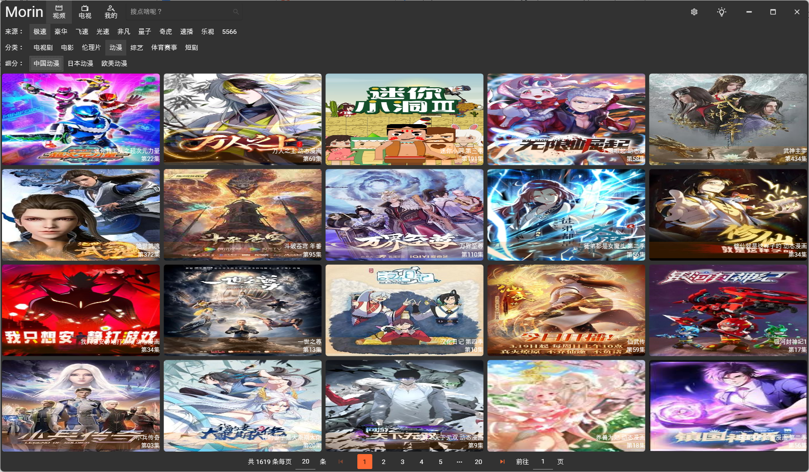
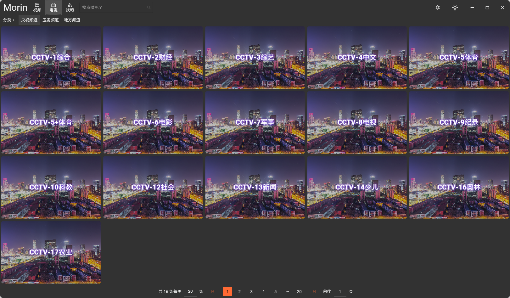
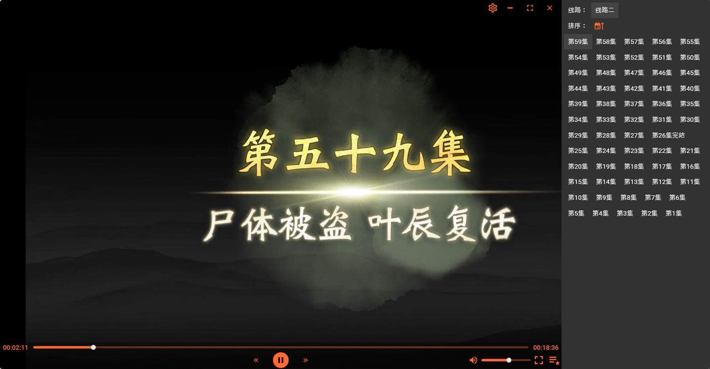

# Morin.Wpf
魔影（Morin),一款基于WPF开发的在线观看视频、电视平台，目前仅对Windows支持。后续开放Android、iOS平台。

## 项目介绍
魔影（Morin），一款基于WPF开发的在线观看视频、电视平台，目前仅对Windows支持。后续开放Android、iOS平台。

## 项目截图

## 项目地址
Github:[https://github.com/kuangxj/Morin.Wpf](https://github.com/kuangxj/Morin.Wpf)

Gitee:[https://github.com/kuangxj/Morin.Wpf](https://gitee.com/heiwuqi/Morin.Wpf)

## 项目说明
魔影（Morin），一款基于WPF开发的在线观看视频、电视平台，目前仅对Windows支持。后续开放Android、iOS平台。 

## 项目特点
1. 支持在线观看视频、电视。
2. 还有一堆，自己运行看看。

## 项目依赖
1. 项目基于.NET 9开发，需要.NET 9运行环境。
2. 依赖Flyleaflib，地址：https://github.com/SuRGeoNix/Flyleaf。
3. 依赖MaterialDesignThemes，地址：https://github.com/MaterialDesignInXAML/MaterialDesignInXamlToolkit。
4. 依赖Stylet，地址：https://github.com/canton7/Stylet。
5. 依赖AutoMapper，地址：https://github.com/AutoMapper/AutoMapper。
6. 依赖FFMPEG，项目中已包含依赖文件。

## 项目运行
1. 下载项目源码。
2. 打开Visual Studio，选择“文件”->“打开”，选择项目源码。
3. 运行项目。

## 项目部署
1. 下载项目源码。
2. 运行项目。

## 项目交流
1. 项目Wechat:cool-kuangxj
2. 项目邮箱:kuangxj#qq.com

## 项目授权
1. 项目采用MIT开源协议。
